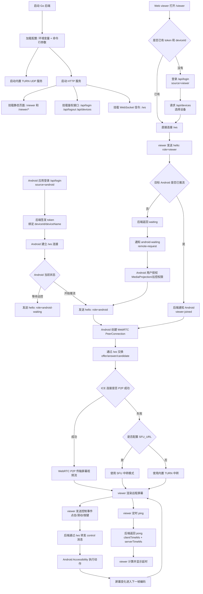
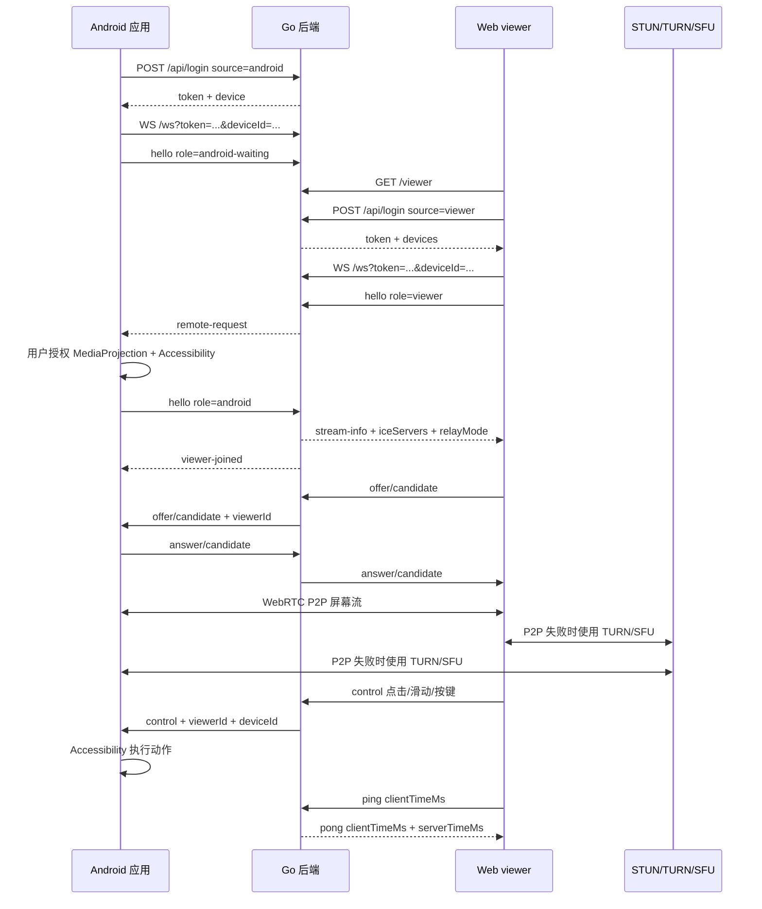

# Lead 远程协助后端

这是 Lead 远程协助项目的 Go 后端。当前后端把静态 viewer 页面、登录鉴权、设备列表、WebSocket 信令和内置 TURN 服务封装在同一个进程中，前端只需要访问静态页面并通过后端提供的 API 与信令通道工作。

## 快速运行

进入后端目录：

```powershell
cd server
```

本地运行：

```powershell
$env:TURN_PUBLIC_IP="127.0.0.1"
go run .
```

局域网真机测试时，`TURN_PUBLIC_IP` 应设置为电脑在局域网中的 IPv4 地址：

```powershell
$env:TURN_PUBLIC_IP="192.168.1.20"
$env:TURN_USERNAME="lead"
$env:TURN_CREDENTIAL="leadpass"
$env:ADMIN_PASSWORD="your-admin-password"
go run .
```

启动后访问：

```text
http://localhost:8787/viewer
```

Android 端连接同一后端：

```text
ws://192.168.1.20:8787/ws
```

运行测试：

```powershell
go test ./...
```

检查 viewer 脚本语法：

```powershell
node --check public/viewer.js
```

## 配置说明

后端优先读取环境变量，也支持对应命令行参数。环境变量更适合部署，命令行参数更适合本地临时调试。

| 环境变量 | 默认值 | 命令行参数 | 说明 |
| --- | --- | --- | --- |
| `TURN_LISTEN_ADDR` | `0.0.0.0` | `-listen` | TURN UDP 监听地址。 |
| `TURN_PORT` | `3478` | `-port` | TURN UDP 监听端口。 |
| `TURN_PUBLIC_IP` | 自动探测非回环 IPv4 | `-public-ip` | 下发给 WebRTC 客户端的 TURN relay 地址。公网部署填公网 IP，局域网测试填局域网 IP。 |
| `TURN_REALM` | `lead.remoteassist` | `-realm` | TURN realm。 |
| `TURN_USERNAME` | `lead` | `-username` | TURN 用户名，不能为空。 |
| `TURN_CREDENTIAL` | `leadpass` | `-password` | TURN 密码，不能为空。 |
| `TURN_MIN_PORT` | `0` | `-min-port` | TURN relay 端口范围最小值，`0` 表示不限制；和 `TURN_MAX_PORT` 必须同时为 `0` 或同时非 `0`。 |
| `TURN_MAX_PORT` | `0` | `-max-port` | TURN relay 端口范围最大值，需要和 `TURN_MIN_PORT` 同时设置。 |
| `TURN_URL` | `turn:<TURN_PUBLIC_IP>:<TURN_PORT>` | 无 | 下发给客户端的 TURN ICE URL，只影响客户端收到的 ICE 配置，不改变内置 TURN 服务实际监听地址。 |
| `HTTP_ADDR` | `0.0.0.0` | `-http-listen` | HTTP、静态资源和 WebSocket 信令监听地址。 |
| `PORT` | `8787` | `-http-port` | HTTP、静态资源和 WebSocket 信令监听端口。 |
| `SFU_URL` | 空 | `-sfu-url` | 配置后信令下发 `relayMode=sfu` 和对应 SFU 地址；为空时下发 `relayMode=turn`。 |
| `AUTH_DB_PATH` | `data/auth.db` | 无 | SQLite 鉴权数据文件路径；设为空字符串会禁用 SQLite 初始化和持久化。 |
| `ADMIN_PASSWORD` | `admin` | 无 | 默认管理员 `admin` 的密码。 |
| `ICE_SERVERS_JSON` | 空 | 无 | 完全自定义下发给客户端的 ICE servers JSON；配置且解析成功时，会替代默认 STUN 和内置 TURN。解析失败时记录日志并回退到默认 ICE 配置。 |

默认 ICE 配置由 `buildICEServers` 生成：

| 顺序 | 默认值 | 说明 |
| --- | --- | --- |
| 1 | `stun:stun.l.google.com:19302` | 默认 STUN。 |
| 2 | `turn:<TURN_PUBLIC_IP>:<TURN_PORT>` | 默认内置 TURN；如果设置 `TURN_URL`，则使用 `TURN_URL`。 |

自定义 ICE servers 示例：

```powershell
$env:ICE_SERVERS_JSON='[{"urls":"stun:stun.example.com:19302"},{"urls":"turn:turn.example.com:3478","username":"lead","credential":"leadpass"}]'
```

公网部署建议固定 TURN relay 端口范围，并在防火墙中放行：

```powershell
$env:TURN_MIN_PORT="50000"
$env:TURN_MAX_PORT="50100"
```

通常需要放行：

| 协议 | 端口 | 用途 |
| --- | --- | --- |
| TCP | `8787` | viewer 静态页面、HTTP API、WebSocket 信令。 |
| UDP | `3478` | TURN 入口端口。 |
| UDP | `TURN_MIN_PORT..TURN_MAX_PORT` | TURN relay 媒体转发端口，设置端口范围时需要放行。 |

## 后端架构

目录结构：

```text
server/
  main.go          程序入口、配置加载、HTTP 路由、TURN 启动
  auth.go          登录鉴权、token、设备绑定、SQLite 持久化
  signaling.go     WebSocket 信令转发、ICE 配置下发、viewer/android 会话管理
  public/          viewer 静态页面资源
  data/            默认 SQLite 数据目录
```

运行时模块：

| 模块 | 文件 | 职责 |
| --- | --- | --- |
| HTTP 静态服务 | `main.go` | 通过 `/viewer` 提供 `public/index.html`，通过 `/viewer/*` 提供 JS/CSS 等静态资源。 |
| 鉴权服务 | `auth.go` | 处理登录、退出、设备列表；维护 token 与设备绑定；使用 SQLite 持久化。 |
| 信令中心 | `signaling.go` | Android 与 viewer 通过同一个 `/ws` 建立 WebSocket，后端按 `deviceId` 转发 WebRTC offer/answer/ICE/control 消息。 |
| TURN 服务 | `main.go` | 基于 Pion TURN 提供 UDP relay，供 WebRTC P2P 失败时中转媒体流量。 |

默认账号：

```text
用户名：admin
密码：admin
```

生产环境必须通过 `ADMIN_PASSWORD` 修改默认密码，并同步修改 `TURN_USERNAME`、`TURN_CREDENTIAL`。

数据持久化使用 SQLite，默认路径为：

```text
server/data/auth.db
```

服务启动时会自动创建表结构。token 和设备绑定会持久化；设备在线状态根据新的 WebSocket 连接重新计算。

## 接口文档

### HTTP 接口

| 方式 | 接口 | 参数 | 返回 |
| --- | --- | --- | --- |
| `GET` | `/` | 无 | 文本 `Hello`，可作为简单健康检查。 |
| `GET` | `/viewer` | 可选 query：`token`、`deviceId` | viewer 页面 `index.html`。 |
| `GET` | `/viewer/{file}` | 路径参数：静态资源文件名，例如 `viewer.js`、`style.css` | 对应静态资源文件。 |
| `POST` | `/api/login` | JSON：`username`、`password`、`source`；Android 端还可传 `deviceId`、`deviceName` | JSON：`token`、`user`、`devices`；Android 登录时额外返回 `device`。 |
| `POST` | `/api/logout` | Header：`Authorization: Bearer <token>`，或 query：`token` | `204 No Content`。 |
| `GET` | `/api/devices` | Header：`Authorization: Bearer <token>`，或 query：`token` | JSON：`{"devices":[...]}`。 |

登录请求示例：

```json
{
  "username": "admin",
  "password": "admin",
  "source": "android",
  "deviceId": "device-1",
  "deviceName": "Pixel"
}
```

登录响应示例：

```json
{
  "token": "64位十六进制token",
  "user": {
    "id": "admin",
    "username": "admin"
  },
  "device": {
    "id": "device-1",
    "name": "Pixel",
    "lastSource": "android",
    "online": false,
    "updatedAt": 1710000000000
  },
  "devices": []
}
```

### WebSocket 信令接口

| 方式 | 接口 | 参数 | 返回 |
| --- | --- | --- | --- |
| `GET` | `/ws` | query：`token`；可选 `deviceId`。连接升级为 WebSocket。 | WebSocket 文本 JSON 消息。鉴权失败返回 `401`，设备不属于当前账号返回 `403`。 |

连接后第一条消息需要发送 `hello`：

| 角色 | 首条消息参数 | 后端行为 |
| --- | --- | --- |
| Android 推流端 | `{"type":"hello","role":"android","deviceId":"device-1", ...}` | 注册为当前设备的活跃推流端，向 viewer 广播 `stream-info`，并下发 `iceServers`、`relayMode`、`sfuUrl`。 |
| Android 等待端 | `{"type":"hello","role":"android-waiting","deviceId":"device-1"}` | 注册为等待远控请求的设备端；当 viewer 加入时收到 `remote-request`。 |
| Web viewer | `{"type":"hello","role":"viewer","deviceId":"device-1"}` | 注册为 viewer；如果 Android 在线则通知 Android `viewer-joined`，否则返回 `waiting`。 |

常见信令消息：

| 消息方向 | `type` | 参数 | 返回/转发 |
| --- | --- | --- | --- |
| viewer -> server | `ping` | `clientTimeMs` | server 返回 `pong`，包含原 `clientTimeMs` 和 `serverTimeMs`，用于计算延时。 |
| viewer -> Android | `offer`、`candidate`、`control` 等 | 任意 WebRTC 或远控控制字段 | server 自动补充 `viewerId`、`deviceId` 后转发给 Android。 |
| Android -> viewer | `answer`、`candidate`、`stream-info` 等 | 需要包含目标 `viewerId`；`stream-info` 会被保存为会话信息 | server 转发给对应 viewer；`stream-info` 会广播给所有 viewer。 |
| server -> Android | `viewer-joined` | `viewerId`、`deviceId` | 通知 Android 有 viewer 加入。 |
| server -> Android | `viewer-left` | `viewerId`、`deviceId` | 通知 Android 有 viewer 离开。 |
| server -> Android waiting | `remote-request` | `deviceId` | 通知等待端有 viewer 请求远程协助。 |
| server -> viewer | `waiting` | 附带 `iceServers`、`relayMode`、`sfuUrl` | 表示目标 Android 当前未进入推流会话。 |
| server -> client | `config` | `iceServers`、`relayMode`、`sfuUrl` | 下发 WebRTC 连接配置。 |

viewer 直达指定设备的访问方式：

```text
http://localhost:8787/viewer?token=<token>&deviceId=<deviceId>
```

对应 WebSocket 地址：

```text
ws://localhost:8787/ws?token=<token>&deviceId=<deviceId>
```

## 整体运行流程

下面使用 Mermaid 绘图公式描述后端、Android 端和 Web viewer 的整体协作流程：



简化时序如下：


